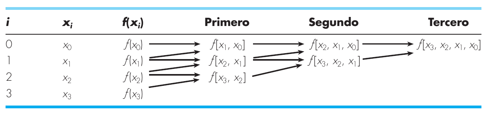

# Métodos Cerrados

​	Los métodos cerrados necesitan dos valores iniciales para la raíz, la cual se encuentra dentro de un intervalo predeterminado por un límite inferior y otro superior.

​	Estos métodos convergen porque se acercan a la raíz a medida de que avanzan las iteraciones.

* Si $f(x_l)$ y $f(x_u)$ tienen signos opuestos, entonces existe un número impar de raíces en el intervalo.

* Si $f(x_l)$ y $f(x_u)$ tienen el mismo signo, entonces no hay raíces o existe un número par de ellas en el intervalo.

## Método de Bisección

​	Es un método de búsqueda incremental, en el que el intervalo siempre se divide a la mitad.

​	Si $f(x)$ es real y continua en el intervalo que va desde $x_l$ hasta $x_u$ y $f(x_l)$ y $f(x_u)$ cambian de signo, entonces en $f(x_l)f(x_u)<0$ hay al menos un raíz real entre $x_l$ y $x_u$. En otras palabras:
$$
Si ~ f(x_l) \cdot f(x_u) < 0 \Rightarrow \exist x_r \in [x_l, x_u]~/~ f(x_r) = 0
$$

### Algoritmo

1. Elegir valores para $x_l$ y $x_u$, de manera que encierren la raíz que que se cumpla $f(x_l)f(x_u)<0$.

2. Se aproxima $x_r$ mediante:
   $$
   x_r = \frac{x_l+x_u}{2}
   $$

3. Se verifica lo siguiente:

   1. Si $f(x_l)f(x_r)<0$, entonces $x_u = x_r$ y se vuelve al paso 2.
   2. Si $f(x_l)f(x_r)>0$, entonces $x_l = x_r$ y se vuelve al paso 2.
   3. Si $f(x_l)f(x_r)=0$, entonces se termina el cálculo

### Tabla

| $i$  | $x_l$ | $x_u$ | $f(x_l)$ | $f(x_u)$ | $x_r$ | $f(x_r)$ |
| :--: | :---: | :---: | :------: | :------: | :---: | :------: |
|      |       |       |          |          |       |          |

### Iteraciones por margen de error

$$
n = ent(\frac{\ln(x_u-x_l)-\ln(\epsilon)}{\ln(2)})
$$

### Estimación de error

$$
\epsilon_a= |\frac{x^{nuevo}_r-x^{anterior}_r}{x^{nuevo}_r}|\cdot100
$$

# Métodos Abiertos

​	Los algoritmos se basan en fórmulas que requieren únicamente un solo valor de inicio, el cual no necesariamente encierran la raíz.

​	Estos métodos aveces divergen o se alejan de la raíz a medida de que avanzan los cálculos.

## Punto Fijo

​	Se debe reescribir la ecuación $f(x)=0$ de tal modo que $x$ esté a un lado de la ecuación. Dando como resultado:
$$
x = g(x)
$$
​	La ecuación va iterando en base al resultado anterior, de modo que que:
$$
x_{i+1}=g(x_i)
$$

### Teorema 

​	Si $\alpha$ es la solución de la ecuación $x_{i+1} = g(x_i)$, y además $\alpha \in I$, entonces se cumple __de manera jerárquica__ qué:

1. $g(x)$ y $g'(x)$ son continuas en $I$
2. $|g'(x)| \leq M < 1, \forall x \in I$
3. $x \in I$ (El intervalo $I$ debe estar dentro de $x$. $x$ se obtiene por el punto 2.)

### Tabla

| $i$  | $x_i$ | $g(x_i)$ | $g'(x_i)$ |
| :--: | :---: | :------: | :-------: |
|  0   | $x_0$ |    -     |     -     |
|  1   |       |          |           |

### Iteraciones por margen de error

$$
\epsilon \leq \frac{M^n}{1-M}|\Delta x|, con\\
\epsilon = x_i-x_n \\
\Delta x = x_1-x_0 \\
M = g'(x+ \epsilon)
$$

### Estimación de error

$$
\epsilon_a=|\frac{x_{i+1}-x_i}{x_{i+1}}|\cdot100
$$

## Newton-Raphson

​	Si el valor inicial de la raíz es $x_i$, entonces se traza una recta tangente al punto $(x_i, f(x_i))$.

​	Dado el hecho de que para obtener la recta tangente a un punto se necesita la derivada, y que para obtener la intersección con el eje $x$ debe cumplir que $f(x_i)=0$. Entonces, la ecuación dada es:
$$
x_{i+1} = x_i - \frac{f(x_i)}{f'(x_i)}
$$

En caso de querer encontrar un punto máximo o un punto mínimo, entonces es posible realizar lo siguiente:
$$
x_{i+1} = x_i - \frac{f'(x_i)}{f''(x_i)}
$$

### Tabla

| $i$  | $x_i$  | $x_{i+1}$ |
| :--: | :----: | :-------: |
|  0   | $x_0 $ |     -     |
|  1   |        |           |

# Raíces de Polinomios

​	Forma general de una ecuación polinomial:
$$
P_n(x) =\sum_{i=0}^{n}a_nx^n
$$

​	Recordar qué:

* En una ecuación grado $n$ hay $n$ raíces reales o complejas
* Si $n$ es impar, existe al menos una solución real

## Interpolación Lineal

​	La idea de la interpolación polinomial es encontrar un polinomio $P(x)$, tal que $P[x_i] = f(x_i)$

​	Esto, tomando en cuenta que el conjunto de polinomios de grado $n$, es en realidad un espacio vectorial de dimensión $n+1$.

​	Con esto, se dará un palo ordenado de la siguiente manera:
$$
P(x_o) = y_0
\\
P(x_1) = y_1
\\
\vdots
\\
P(x_i) = y_i
$$
​	o también puede estar escrito así:

| $x$  | $x_0$ | $x_1$ | $\cdots$ | $x_i$ |
| ---- | ----- | ----- | -------- | ----- |
| $y$  | $y_0$ | $y_1$ | $\cdots$ | $y_i$  |

​	Se resuelve con la siguiente matriz

| 1    | $x_0$    | $x^2_0$  | $x^n_0$  | $y_0$    |
| ---- | -------- | -------- | -------- | -------- |
| 1    | $x_1$    | $x^2_1$  | $x^n_1$  | $y_1$    |
| 1    | $\cdots$ | $\cdots$ | $\cdots$ | $\cdots$ |
| 1    | $x_n$    | $x^2_n$  | $x^n_n$  | $y_n$    |

## Interpolación de Newton

$$
b_0 = f(x_0)
\\
b_1 = f[x_1,x_0]
\\
\cdots
\\
b_n = f[x_n, x_{n-1},\cdots,x_1,x_0]
$$

$$
f[x_i,x_j] = \frac{f(x_i)-f(x_j)}{x_i-x_j}
\\
f[x_i,x_j, x_k] = \frac{f[x_i,x_j]-f[x_j, x_k]}{x_i-x_k}
$$

## Polinomio de Lagrange

$$
L_i(x)=\prod_{j=0}^n \frac{x-x_j}{x_i-x_j}, ~ j \neq i
$$